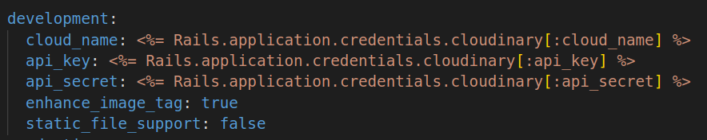

# GYMIFY API

A RESTFUL API built with Ruby on Rails. The application exposes API endpoints for a gym front end application. The application allows user to register, login, view trainers and book appointments with trainers.

## End Points

There are a couple of endpoints exposed by this api and can be accessed online using `https://gymify-backend.herokuapp.com/api/v1` as the base Url.

## POST

- /auth - (create user account)
- /auth/sign_in - (log in to account)
- /appointments - (create appointment)

## GET

- /me - (fetch user info)
- /trainers - (fetch all trainers)
- /appointments - (fetch all appointments for current user)
- /appointments/:id - (fetch one appointments for current user)

## Built With

- Ruby on Rails
- Postgresql
- Heroku
- Rspec
- Devise-Auth-Token
- Cloudinary

## Live Demo

For the full working application Click [here](https://gymify-backend.herokuapp.com/api/v1)

## Installation

To get a local copy up and running follow these simple example steps.

### Setup

Clone [this](https://github.com/OlawaleJoseph/E-Vote-Backend.git) repository

### Follow:

1. cd into the project directory
2. run bundle install
3. run rails db:migrate
5. create rails credentials for cloudinary, check below for format
  

    
  

6. run rails s to start the server.
7. Make request to the api via a tool such as Postman

### Run tests
  - run `rpsec`

## Author

👤 **Adedeko Olawale**

- Github: [@OlawaleJoseph](https://github.com/OlawaleJoseph)
- Twitter: [@javanode123](https://twitter.com/javanode123)
- Linkedin: [olawale-adedeko](http://www.linkedin.com/in/olawale-adedeko)

## 🤝 Contributing

  - Contributions, issues and feature requests are welcome!

  - Feel free to check the [issues page](https://github.com/OlawaleJoseph/E-Vote-Backend/issues)

## Show your support

  - Give a ⭐️ if you like this project!
